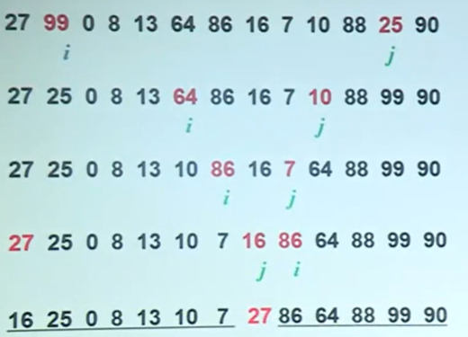
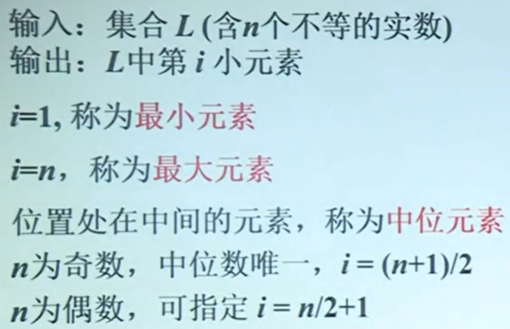

# 基本思想


### 分治策略

- 将原始问题划分或归结为规模较小的子问题
- 递归或迭代求解每个子问题
- 将子问题的解综合得到原问题的解

### 注意

- 子问题与原始问题性质完全一样
- 子问题直接按可彼此独立的求解
- 递归停止时子问题可直接求解

### 时间复杂度

```
方程：
W(n) = aW(n/b) + d(n)
a:子问题；n/b：子问题规模；d(n)：划分与综合工作量
```

## 二分检索

### 设计思想

**通过和数组中间的数m比较，若等于就直接找到，若小于在前半个数组在继续与中间的数进行比较，若大于在后半个数组与中间的数进行比较，循环下去，直到找到为止。**

## 二分归并

### 设计思想

**将数组从中间划分为两个子数组作为两个子问题求解，继续划分，直到子问题规模为1时结束，然后合并成原始数组**

## Hanio塔的递归算法

设N个盘子移动次数T(n)
$$
\begin{aligned}
&T(n)=2T(n-1)+1 \\
&T(n)=1 \\
&T(n)=2^n -1 \\
\end{aligned}
$$

### 设计思想

**将原问题归结为规模为n-1的2个子问题**

**继续规约，将原为问题归结为规模n-2的4个自问题，继续……，当子问题规模为1结束**

**从规模1到n-1，陆续的组合两个子问题的解，直到规模为n**

## 快速排序

### 基本思想

> 用数组的首元素x作为划分标准。将输入的数组A划分不超过x的元素构成的数组A1,大于x的元素构成的数组A2，其中A1，A2从左到右存放到数组A的位置。
>
> 递归的对子问题A1和A2进行排序，直到子问题规模为1时停止

### 划分实例



### 时间复杂度

> ```
> 最坏情况
> W(n) = W(n-1) + n-1
> W(1) = 0
> W(n) = n(n-1)/2
> 
> 最好情况：
> T(n) = 2T(n/2) + n-1
> T(1) = 0
> T(n) = (nlogn)
> ```

## 选最大最小



## 卷积应用

### 公式

$$
\begin{aligned}
&a*b=(c_1,c_2,c_3,.....,c_n) \\
&C_k = \sum_{i+j=k} a_ib_i \\
\end{aligned}
$$


