# 动态规划


## 动态规划算法

多阶段决策过程，每步求解的问题是后面阶段求解问题的子问题，每步决策将依赖于以前依赖的决策结果

## 基本思想

分解得到的各个子问题往往不是相互独立的，在求解过程中，将已解决的子问题的解进行保存，在需要时可以轻松找出来，这样就可以避免了大量的无意义的重复计算，从而降低算法的时间复杂性。

## 三个基本要素

#### 最优子结构性质

> 问题的最优解包含其子问题的最优解
>
> #### 子问题重叠性质
>
> 把已解决的子问题的解存储在表中，便于以后遇到直接引用，从而不必重新求解，提高效率
>
> #### 自底向上的求解方法
>
> 选择合适的表格，将递归的停止条件填入表格的相应位置；然后将问题的规模一级一级放大，求出每一级的最优解
>

## 矩阵链相乘

**确定乘法得顺序，使得元素相乘得总次数最少**

#### 例

$$
\begin{aligned}
&A_1:10\times100,A_2:100\times5,A_3:5\times50 \\
&乘法次序 \\
&(A_1A_2)A_3:10\times100\times5+10\times5\times50=7500 \\
&A_1(A_2A_3):10\times100\times50+100\times5\times50=75000 \\
&第一种次序计算次数最少
\end{aligned}
$$

#### 使用动态规划算法(递归)

#### 子问题划分

假设：矩阵链A<sub>1</sub>A<sub>i+1</sub>……A<sub>J</sub>，

#### 子问题得依赖关系

k就是放括号的位置，用两个括号将矩阵链分成两部分，递归调用自己将两部分的矩阵在继续分，k从1考试直到找到最优解

最优划分最后依次相乘发生在矩阵K的位置，即A<sub>i…j</sub> =A<sub>i…k</sub>A<sub>k+1…j</sub>

A<sub>i…j</sub>最优运算次数依赖于A<sub>i…k</sub>与A<sub>k+1…j</sub>的最优运算次数

#### 优化函数的递推方程

m[i,j]：得到A<sub>i…j</sub>的最少的相乘次数
$$
m[i,j]=\left\{
\begin{aligned}
&0 \qquad\qquad\qquad\qquad\qquad\qquad\qquad\qquad\qquad\qquad i=j\\
&m[i,j]_{i<k<j}{m[i,k]+m[k+1,j]+P_{i-1}+P_kP_j}\quad i<j\\
\end{aligned}
\right.
$$

#### 递归实现

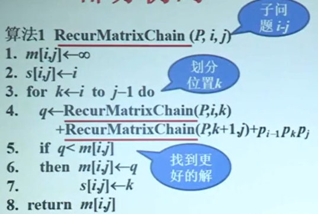

#### 时间复杂度

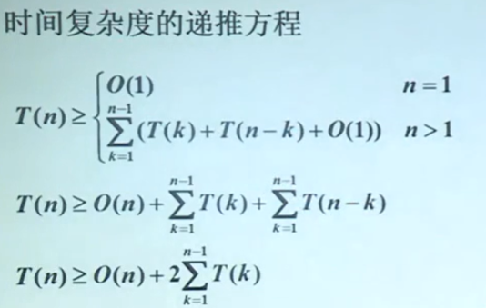
$$
\begin{aligned}
&T(n)\geqslant2^{n-1}
\end{aligned}
$$


#### 迭代实现的实例

```
每个问题只计算一次
迭代过程：从最小的子问题算起，考虑计算顺序，以保证后面用的值前面已经计算好了，保存计算结果
```

```
矩阵链：
A_1 : 30X35, A_2 : 35X15,A_3 : 15X5
A_4 : 5X10, A_5 : 10X20
```

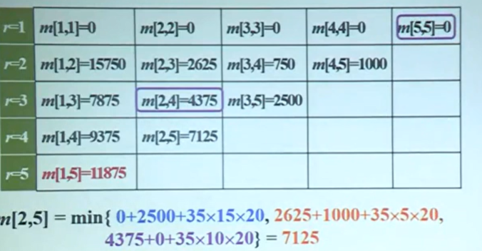

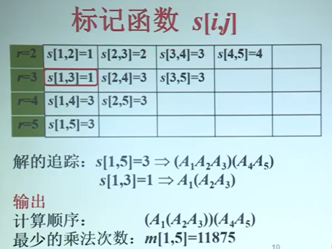

## 投资问题的建模

> 问题：m元钱，n项投资，F<sub>i</sub>(x)：将x元投入到第i歌项目的效益，求得总效益最大得投资方案。
>
> 目标函数：max{f<sub>1</sub>(x<sub>1</sub>)+f<sub>2</sub>(x<sub>2</sub>)+…+f<sub>n</sub>(x<sub>n</sub>)}
>
> 约束条件：x<sub>1</sub>+x<sub>2</sub>+…+x<sub>n</sub>=m，x<sub>i</sub>属于N

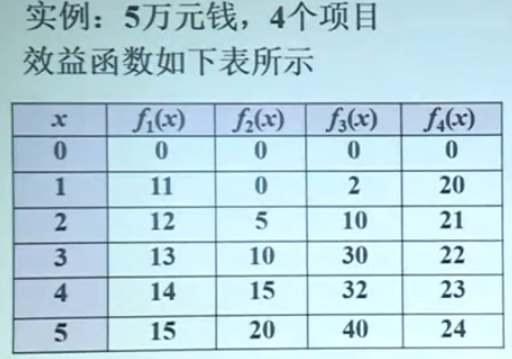

递推方程：

> **F<sub>k</sub>(x)=max<sub>0<x<sub>k</sub><x</sub>{f<sub>k</sub>(x<sub>k</sub>)+f<sub>k-1</sub>(x-x<sub>1</sub>)} k>1**
>
> 当投资给第i歌项目，剩下得钱给它前面得项目
>
> **F<sub>1</sub>(x)=f<sub>1</sub>(x)**

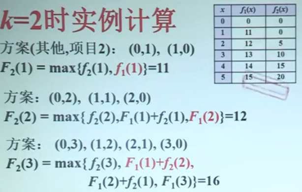

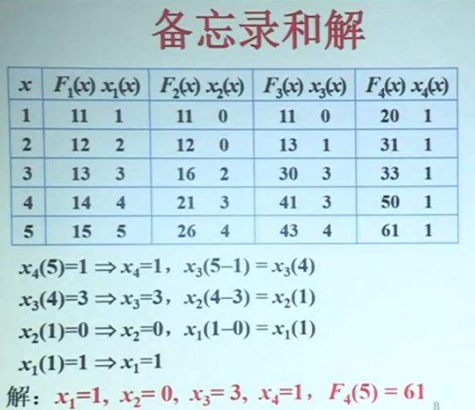

## 背包问题

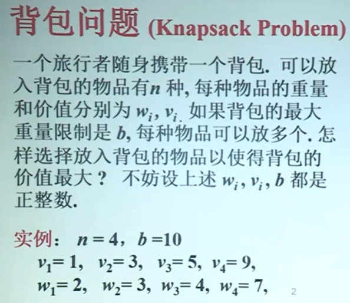

### 建模：

解是<x<sub>1</sub>,x<sub>2</sub>,…x<sub>n</sub>>,其中x<sub>i</sub>是装入背包得第i中物品个数

目标函数：max∑ v<sub>i</sub>x<sub>i</sub>

约束条件：∑ v<sub>i</sub>x<sub>i</sub><b

#### 子问题界定：

k：考虑对物品1，2，...，k得选择

y：背包总重量不超过y

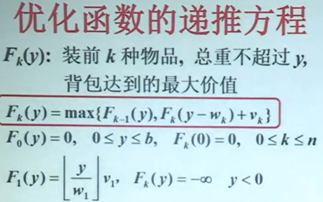

F<sub>1</sub>(y)表示如果只选择第一个物品，可以选择多少个

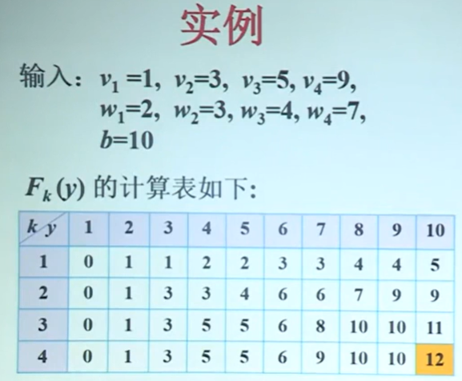

## 最长公共子序列

#### 子序列

> X = <x<sub>1</sub>,x<sub>2</sub>,…,x<sub>m</sub>>
>
> Z = <z<sub>1</sub>,z<sub>2</sub>,…,z<sub>k</sub>>
>
> 若存在X的元素构成的严格递增序列使得
>
> z<sub>j</sub> = x<sub>i</sub><sub>j</sub>,  j = 1,2,…,k   i = 1,2,…,m
>
> 称Z是X的子序列
>

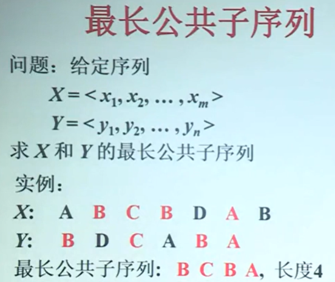

#### 递推方程

$$
\begin{aligned}
&令X与Y的子序列\\
&X_i=<x_1,x_2,…,x_i>,Y_j=<y_1,y_2,…,y_j>\\
&C[i,j]:X_i与Y_j的最长公共子序列的长度\\
\\
&C[i,j]=C[i-1,j-1]+1 \quad 若x_1=y_1\\
&C[i,j]=max\{C[i,j-1],C[i-1,j]\}\quad 若x_1\not=y_j\\
\end{aligned}
$$

## 动态规划算法的应用

### 最优二叉检索树

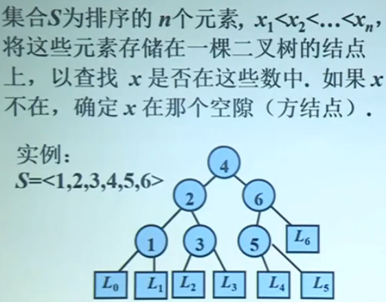

#### 检索方法

```
初始，x与根元素比较：
x<根元素，递归进入左子数
x>根元素，递归进入右子数
x=根元素，算法停止，输出x
x到叶结点算法停止，输出x不在数组中
```

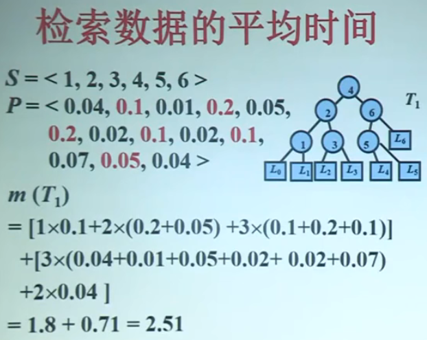

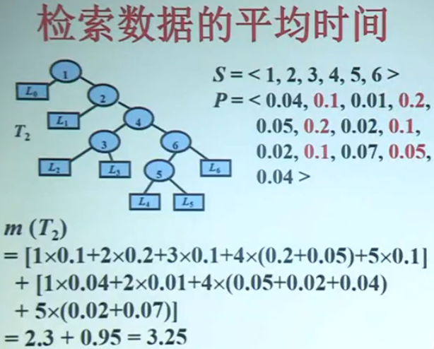

#### 平均比较次数计算

$$
\begin{aligned}
&结点x_i在T中的深度是d(x_i),i=1,2…，n\\
&空隙L_j的深度是d(x_i)(同行数据深度-1),j=0,1…,n\\
&b_i：是检索的概率\\
&a_i：是空隙检索的概率\\
&平均比较次数为：\\
&\sum_{i=1}^n b_i(1+d(x_i))+\sum_{j=0}^n a_jd(L_j)\\
\end{aligned}
$$

### 最优二叉树检索算法

#### 子问题划分

> 子问题边界为(i,j)
>
> 数据集：S[i,j]=<x<sub>1</sub>,x<sub>i+1</sub>,…,x<sub>j</sub>>
>
> 存取概率分布：P[i,j]=<a<sub>i-1</sub>,b<sub>i</sub>,a<sub>i</sub>,b<sub>i+1</sub>…,b<sub>j</sub>,a<sub>j</sub>>

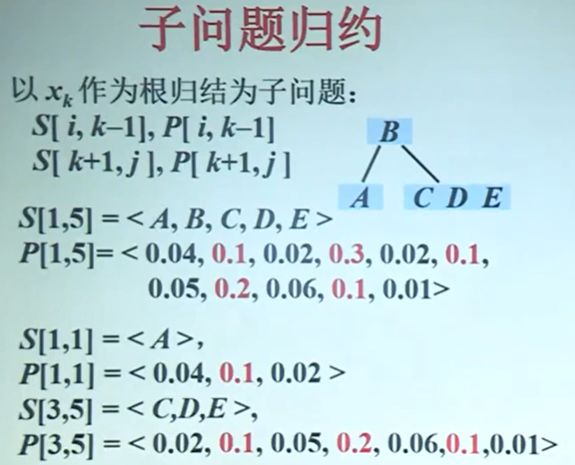

子问题的概率之和

子问题界定S[i,j]和P[i,j]，令
$$
\begin{aligned}
&w[i,j] = \sum_{p=i-1}^j a_p+\sum_{q=1}^jb_q\\
\end{aligned}
$$
是P[i,j]中所有概率(数据于空隙)之和

#### 递推方程：

设m[i,j]是相对于输入S[i,j]和P[i,j]的最优二叉搜索树的平均比较次数

w[i,j]：代表所有检索的概率

**m[i,j]=min<sub>i<=k<=j</sub>{m[i,k-1]+m[k+1,j]+w[i,j]}**

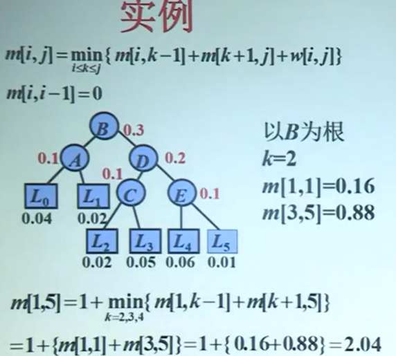

### 序列比对

#### 编辑距离

给定两个序列S<sub>1</sub>和S<sub>1</sub>，通过一序列字符编辑(插入，删除，替换)等操作，将S<sub>1</sub>转变成S<sub>1</sub>。完成这种转换所需要的最少的编辑操作个数为S<sub>1</sub>和S<sub>1</sub>的编辑距离。

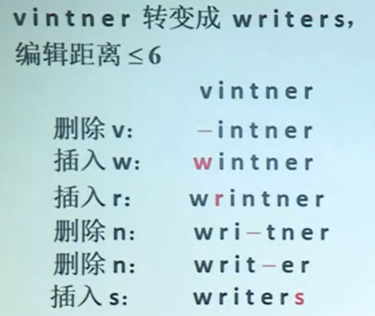


