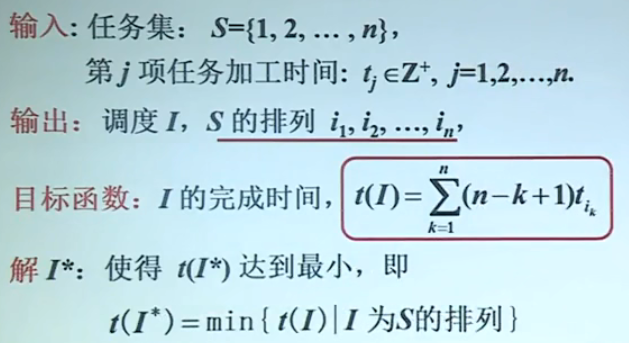
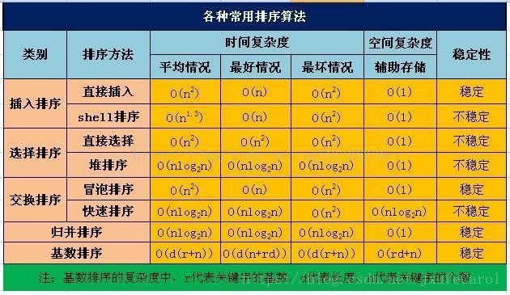
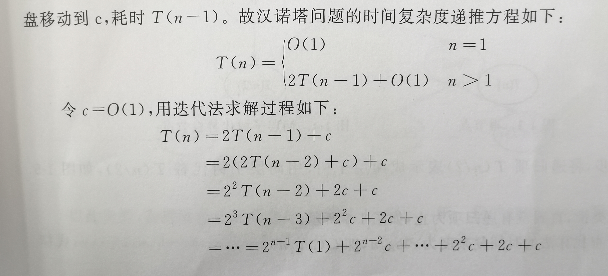
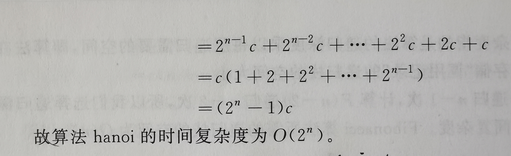
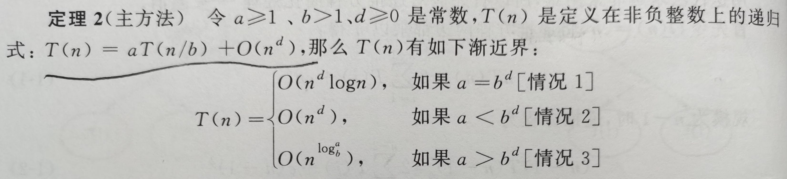

# 算法分析与设计

------

### 算法：是解决问题的方法步骤的描述

#### 特性：

1. 输入
2. 输出
3. 确定性
4. 有限性
5. 可行性

#### 算法的描述方式：

- 自然语言
- 程序流程图
- 程序设计语言
- 伪代码

#### 算法设计的一般过程

1. 理解问题
2. 问题建模
3. 算法设计
4. 验证算法的正确性
5. 算法分析：分析算法的时间复杂度

## 调度问题实例

#### 任务集  S = {1,2,3,4,5}

#### 加工时间：t1 = 3，t2 = 8，t3 = 5， t4 = 10，t5 = 15

##### 贪心法：

算法：按加工时间（3，8，5，10，15）从小到大安排

3，5，8，10，15

总完成时间 t = 3+(3+5)+(3+5+8)+(3+5+8+10)+(3+5+8+10+15)=94

##### 问题建模

##### 算法设计

加工时间短的先做

##### 算法正确性

对所有输入实例都得到最优解

## 背包问题

有4个物品要装入背包，重量和价值如下

| 标号  | 1    | 2    | 3    | 4    |
| ----- | ---- | ---- | ---- | ---- |
| 重量w | 3    | 4    | 5    | 2    |
| 价值v | 7    | 9    | 9    | 2    |

背包限重是6，问如何选择物品，使得不超重的情况下装入背包的物品价值达到最大？

#### 解：

单位价值大的优先，按照v/w从大到小排序：

##### 贪心算法的解：

{1，4} 重量5，价值9

##### 更好的解：

{2，4} 重量6，价值11

## 排序算法的效率

### 函数

#### O：渐近上界

##### 公式：

$$
\begin{aligned}
&O(f)+O(g)=O(max(f,g))\\
&O(f)+O(g)=O(f+g)\\
&O(f)O(g)=O(fg)\\
&若g(n =O(f(n)),则O(g)+O(f)=O(f)\\
&f=O(f)\\
\end{aligned}
$$

#### Ω：渐近下界

#### Θ：渐近精确界

## 递推方程

#### 迭代算法

**思路**

1. 不断用递推方程的右部替换左部
2. 每次替换，随着n的降低在和式中多出一项
3. 直到出现初值停止迭代
4. 将初值待人求和
5. 用数学归纳法验证解的正确性

#### 差消法

利用两个方程相减，将右边的项可能削去，达到降阶的目的

#### 递归树

每个叶结点是一个函数项，根结点是总和

**生成规则：**将函数项叶结点通过迭代不断生成二层子树，直到有初值为止

#### 主方法

适用递推方程

​			O(1)		n=1
​			aT(n/b)+O(n^d^)      n>1

注解：a代表有多少个子问题，n/b代表将问题缩小为原来的b倍的子问题

O(n^d^)  代表解决这个问题的工作量

定理：

