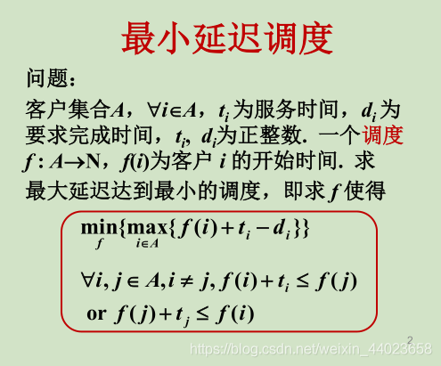

## 贪心算法的基本要素

### 最优子结构性质

#### 证明问题是否具有的步骤如下：

1. 先设出问题的最优解
2. 给出“子问题的解一定是最优的”的结论
3. 采用反证法证明结论成立

### 贪心选择性质

通过一系列局部最优的选择获得，即通过逐步局部最优选择使最优选择使最终的选择方案是全局最优的

#### 贪心法的优势：

算法简单，时间和空间复杂性低

## 贪心算法正确性证明

##### 第一数学归纳法：

```中文
证明涉及自然数的命题P(n)

归纳基础：证明P(1)为真（或P(0)为真）

归纳步骤：若对所有n有P(n)为真，证明P(n+1)为真
```

##### 第二数学归纳法：

```chinese
证明涉及自然数的命题P(n)

归纳基础：证明P(1)为真（或P(0)为真）

归纳步骤：若对所有小于n的k有P(k)真，证明P(n)为真
```

#### 最小延迟调度问题描述



```
f(i) 表示某任务 开始的时间

 ti  表示 某任务 加工的时间

di  表示 某任务 要求完成的时间

延迟：  f(i)+ti-di
```

##### 设计思想：

按完成时间从小到大安排任务，没有空闲

##### 定理：

> F(1)交换相邻i，j的逆序，得到的F(2)解任然最优
>
> i在F(2)的延迟小于J在F(1)的延迟
>
> 没有逆序，没有空闲时间的解与算法解具有相同的最大延迟
>

## 得不到最优解的处理：

#### 输入参数分析：

考虑输入参数在什么群志范围内使用贪心法可以得到最优解

#### 误差分析：

估计贪心法：近似算法所得到的解与最优解的误差


