## 一二元前缀码

用0-1字符串作为代码表示字符，要求任何字符的代码都不能作为其他字符代码的前缀

### 二叉树表示

0：左子数

1：右子数

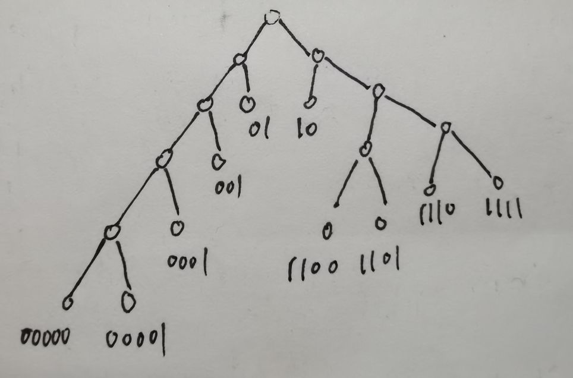

前缀码：{00000，00001，0001，001，01，10，1100，1101，1110，1111}

$$
\begin{aligned}
&平均传输位数：B(\sum_{i=1}^{n} 频率 *深度)/100%\\
\end{aligned}
$$

**最优前缀码：平均传输位数最小**

## 哈夫曼算法

不断从队列中找到两个频率最小的作为子结点，合并成一个父结点，父结点的频率等于两个子结点频率之和，当队列中只剩一个数时，二叉树就生成了。

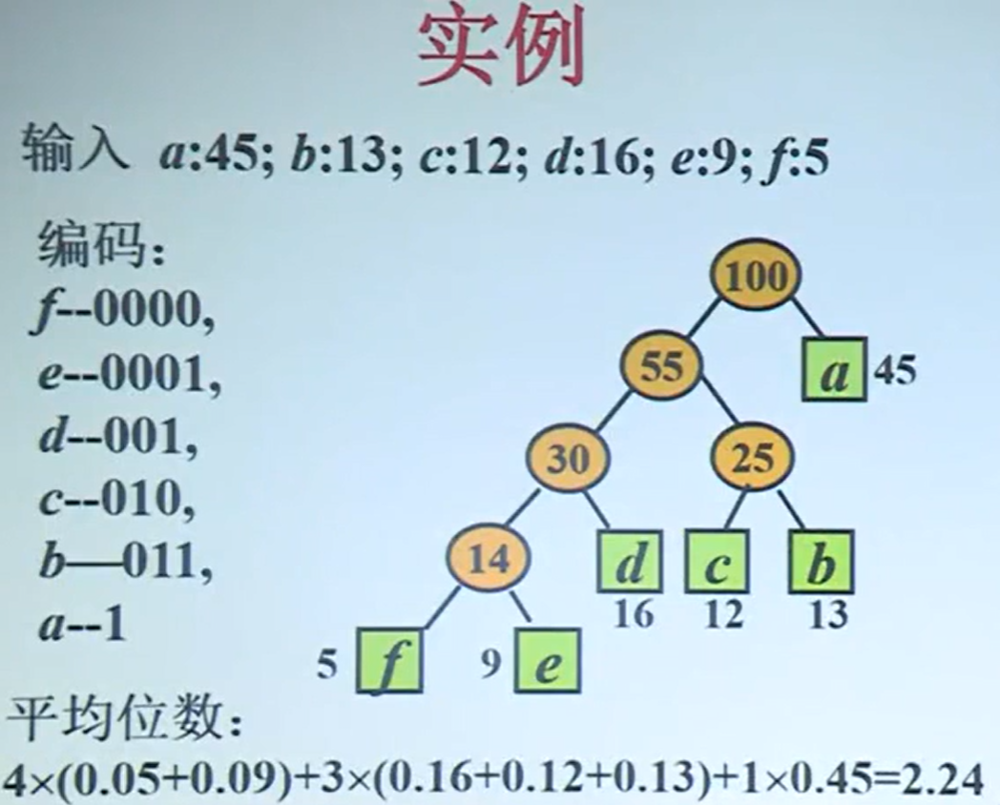

### 定理

如果把一个二叉树的父结点的两个子节点去掉得到新的树

新旧两棵树权值之差等于去掉的两个子节点频率之和

**哈夫曼算法得到的都是最优前缀码**

### 应用：文件归并

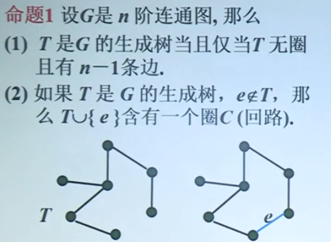

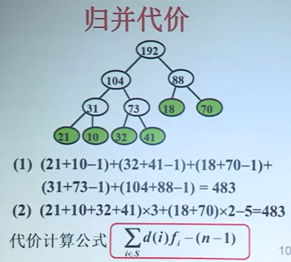

**(2)：每个叶结点项数 * 深度 - (叶结点个数-1)**

### 实例：Huffman树归并

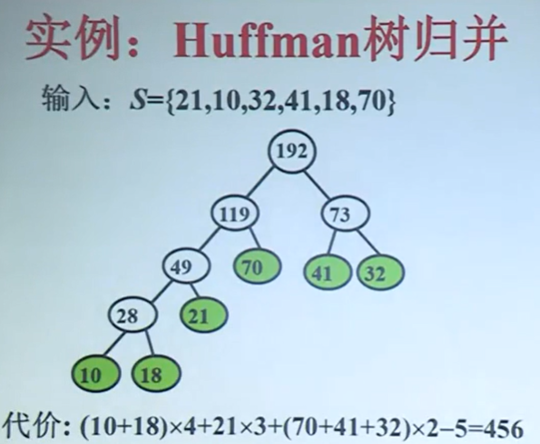

## 最小生成树

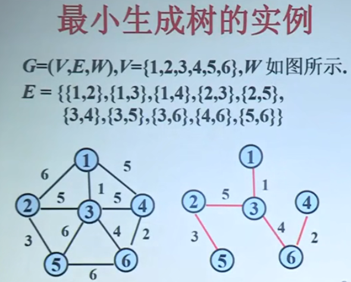

### 性质

（3）去掉圈C的任意一条边，就得到另一个生成树 T^'^

### 生成树性质的应用

> 算法步骤：选择边
> 约束条件：不形成回路
> 截止条件：边数达到n-1
>
> 求最小生成树：使用贪心法：（Prim ,Kruskal， 时间复杂度都是0(n)）

## Prim算法

### 设计思想

初始结点**i**，选择集合中与**i**连接权值最小的边，依次进行下去，直到所有所有结点都连接

### 伪码

$$
\begin{aligned}
&S \leftarrow \{1\} \\
&while V - S \neq\varnothing do \\
&从V-S中选择j使得j到S中顶点的边权最小\\
&S \leftarrow S \cup \{j\}
\end{aligned}
$$

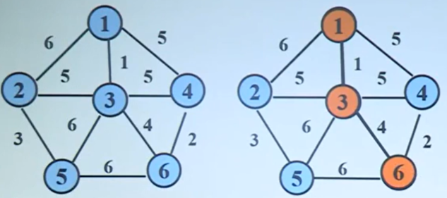

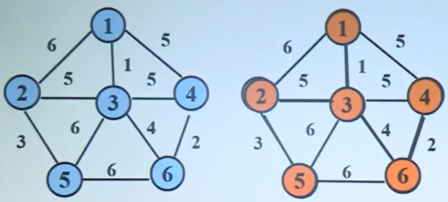

## Kruskal算法

### 设计思想

> - 按照边的长度从小到大对边进行排序(T代表最小生成树)
> - 依次考察当前最短边e，如果e与T中边不构成回路，则把e加入树T，否则跳过e，直到选择了n-1条边为止。

### 伪码

$$
\begin{aligned}
&权从小到大排序E的边 \\
&S \leftarrow \varnothing \\
&repeat \\
&e \leftarrow E 中的最短边 \\
&if \quad e 的两端点不在同一连通分支\\
&then \quad T \leftarrow T \cup \{e\} \\
&E \leftarrow E - \{e\} \\
&until \quad T 包含了n-1条边
\end{aligned}
$$

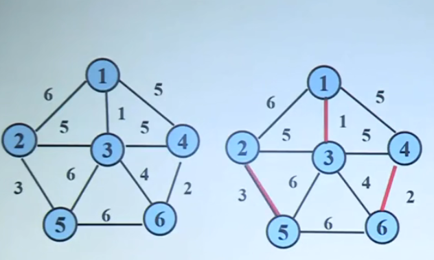

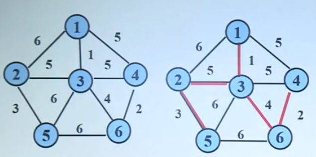

> **注：先找最小的边，然后连接起来**

## Dijksra算法(单源最短路径)

### 有关概念

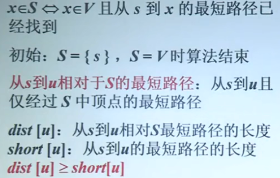

### 算法的设计思想

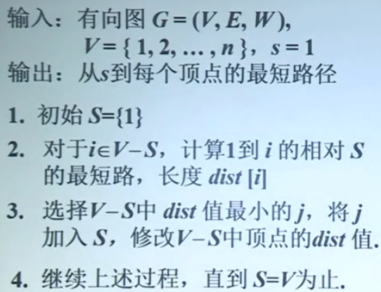

### 伪码

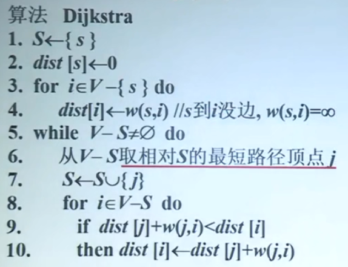

